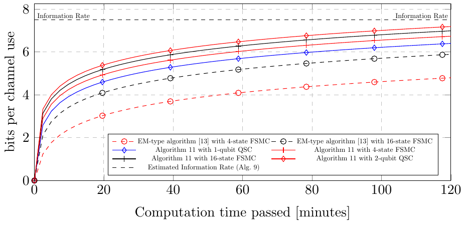
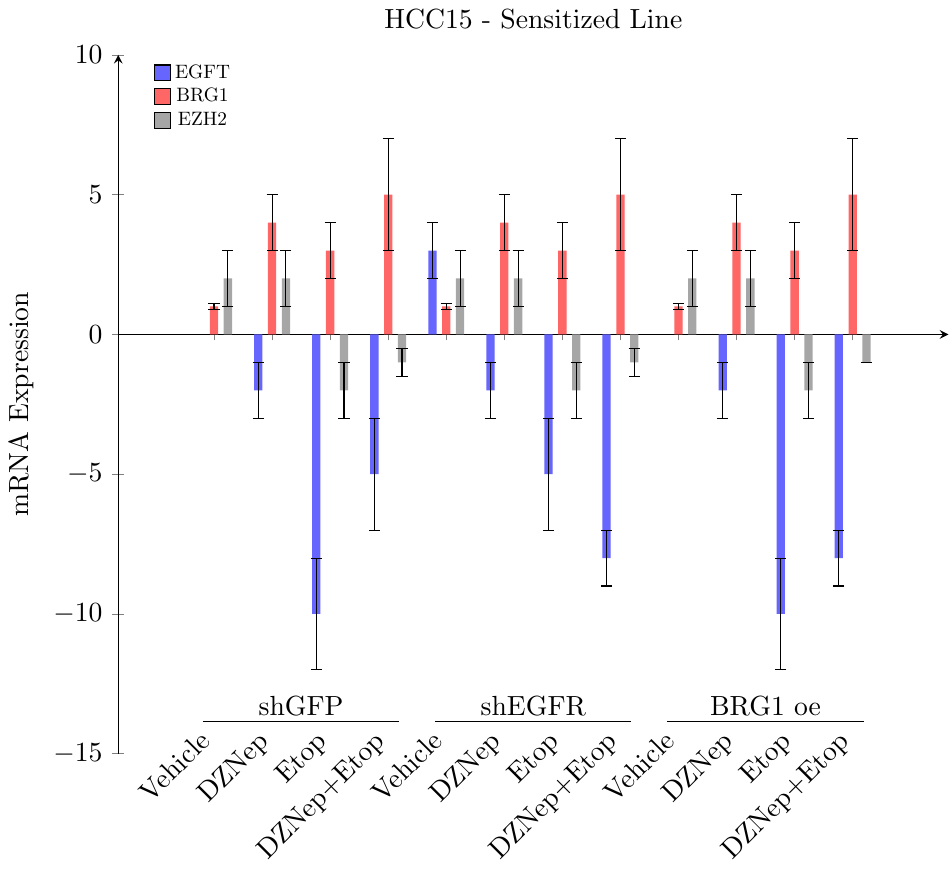
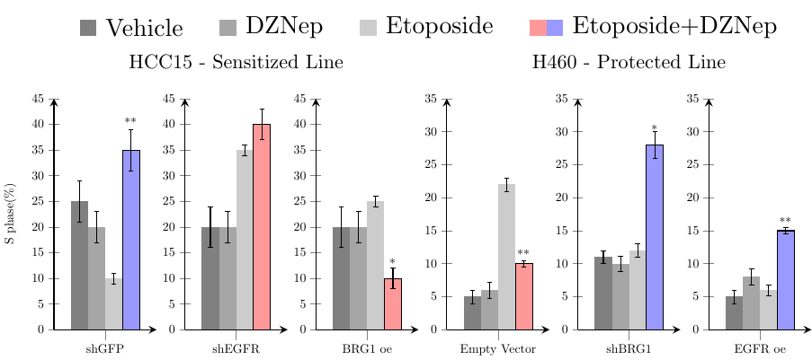
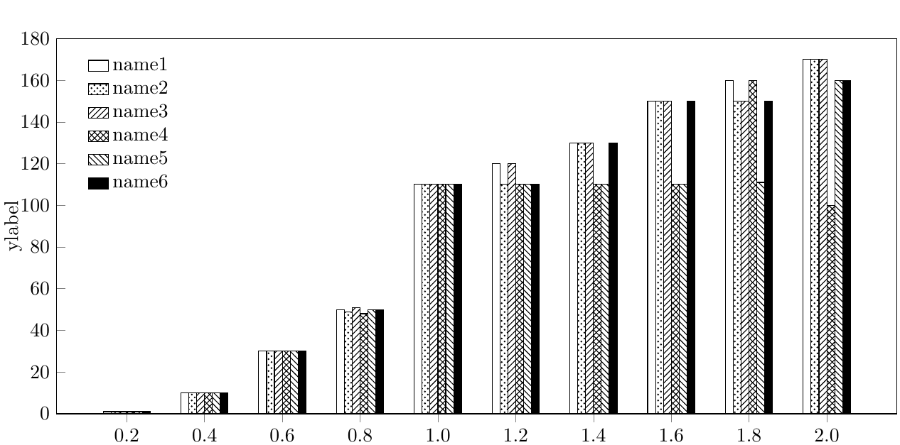
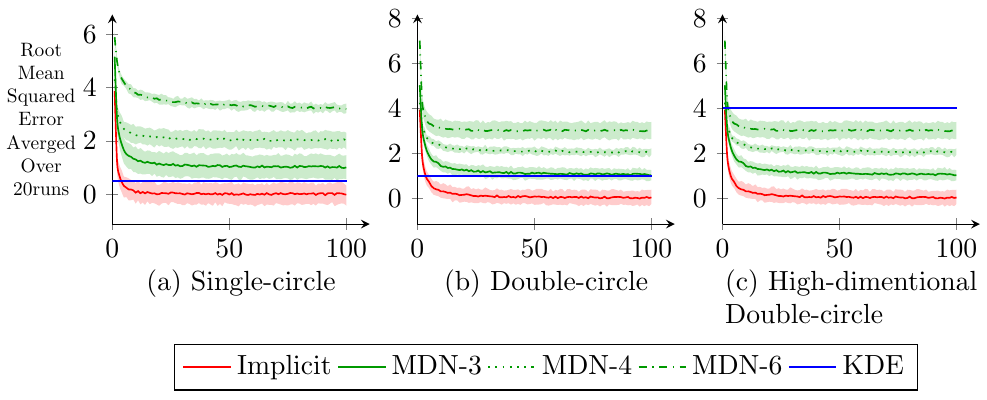
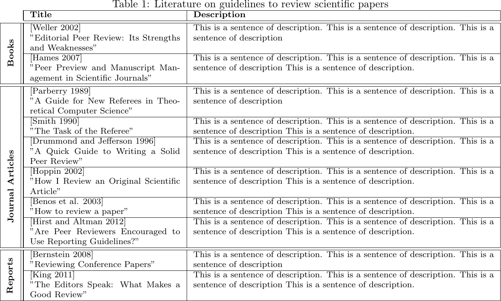
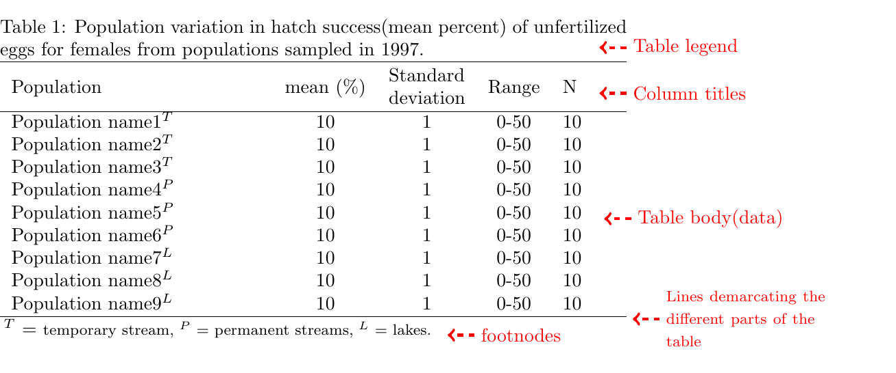
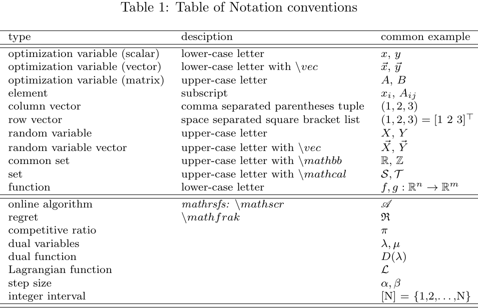
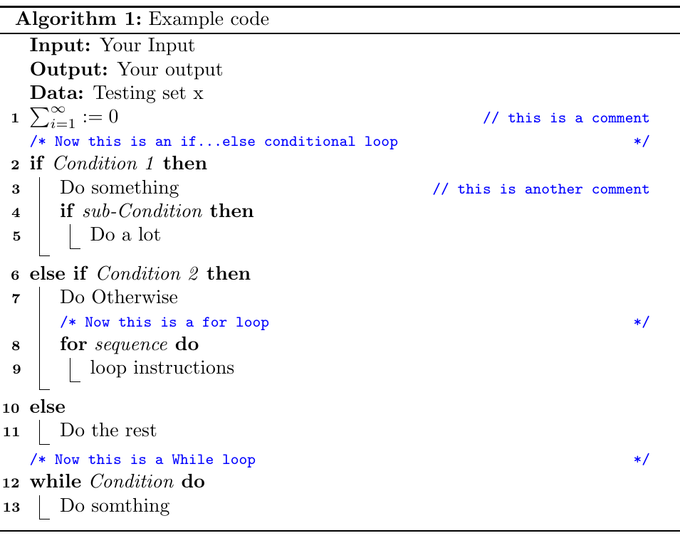

# My LaTeX Gallery
This is a small gallery of latex examples. I found some good figures/tables in the literature and reproduce them with latex. 
Every example corresponds to a **standalone** tex file in the folder `submodules`. 
Feel free to take a glance at the following available illustrations. 

# Illustrations
- [Figures](#Figures)
- [Tables](#Tables)
- [etc](#etc)
## Figures
### Figure 1 [[SRC]](submodules/fig1/fig1.tex)

### Figure 2a [[SRC]](submodules/fig2a/fig2a.tex)

### Figure 2b [[SRC]](submodules/fig2b/fig2b.tex)

### Figure 3a [[SRC]](submodules/fig3a/fig3a.tex)

### Figure 3b [[SRC]](submodules/fig3b/fig3b.tex)

### Figure 4 [[SRC]](submodules/fig4/fig4.tex)

## Tables
### Table 1 [[SRC]](submodules/tab1/tab1.tex)

### Table 2 [[SRC]](submodules/tab2/tab2.tex)

### Notation table [[SRC]](submodules/notation/notation.tex)

## etc
### Algorithm 1 [[SRC]](submodules/alg1/alg1.tex)

