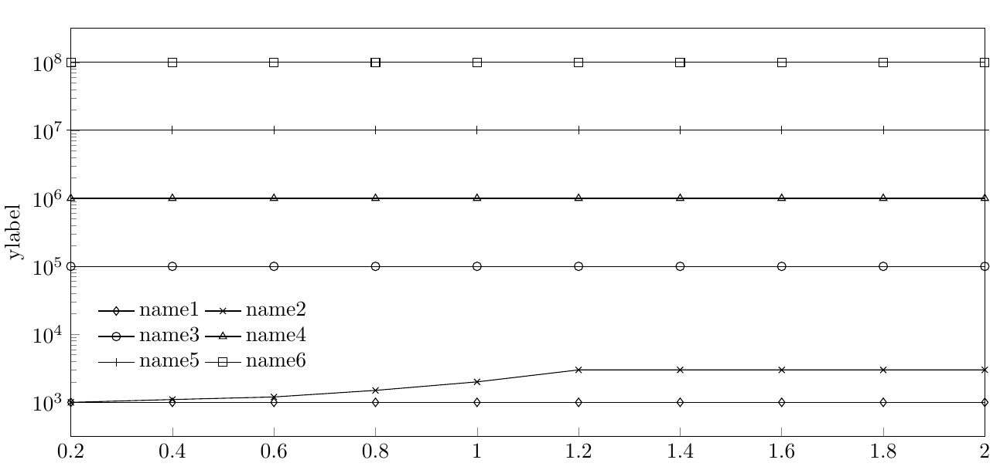

# My LaTeX Gallery
This is a small gallery of latex examples. I found some good figures/tables in the literature and reproduce them with latex. 
Every example corresponds to a **standalone** tex file in the folder `submodules`. 
Feel free to take a glance at the following available illustrations. You can also find it in the . 

# Illustrations
- [Figures](#Figures)
- [Tables](#Tables)
- [etc](#etc)
## Figures
### Figure 1

### Figure 2a

### Figure 2b

### Figure 3a

### Figure 3b

## Tables
### Figure 5

### Figure 6

## etc
### Figure 4

